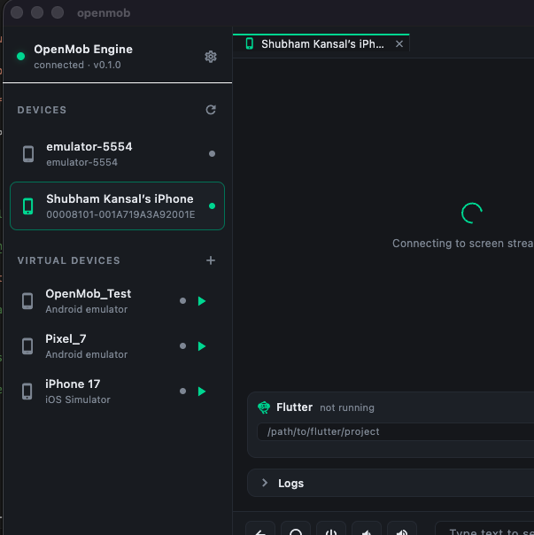

# OpenMob

Your phones, on your desktop — for you and your AI. Mirror, tap, type, install,
log, and debug real Android and iOS devices from one window, over USB or Wi-Fi.
Runs on **macOS and Windows** (Android + emulators everywhere; iOS is macOS-only).



OpenMob is an open-source device lab. It puts every phone, emulator, and
simulator you own into a single desktop app — with a live screen you can click, app
logs scoped to *your* app, Flutter hot reload, and a built-in debugger. And
because it speaks [MCP](https://modelcontextprotocol.io), an AI agent like Claude
can drive those same devices for you: "open my app, tap through checkout, and
tell me what the logs say."

- Live screen mirror with click-to-tap and drag-to-swipe
- **Android and iOS** — real devices, plus emulators and simulators
- App-scoped logs, crash reports, deep links, and file transfer
- **Flutter run-mode** with real hot reload, hot restart, and DevTools
- Create and launch emulators/simulators — headless, right inside the app
- An **MCP server** so Claude and other agents can control your devices
- One Python engine, a Mac app, and a CLI — MIT licensed, no subscription

---

## What you can do

| | |
| --- | --- |
| **Mirror & control** | Watch a device live and tap, swipe, type, and press keys straight on the screen |
| **Manage apps** | Install, launch, force-stop, uninstall, clear data, open deep links |
| **See what's happening** | Stream logs filtered to a single app, pull crash reports, read battery/OS/model |
| **Debug Flutter** | Launch your project through OpenMob and get working hot reload, hot restart, and DevTools |
| **Debug iOS** | Attach an interactive lldb session to an app — breakpoints, step, eval, backtraces |
| **Spin up devices** | List, create, and boot Android AVDs and iOS simulators without leaving the app |
| **Let AI drive** | Point Claude at the MCP server and it can do all of the above on your behalf |

---

## Install

**1. Get the app.** From the
[Releases](https://github.com/ZevnixAi-Applications/OpenMob/releases/latest)
page, download the installer for your OS:

- **macOS** — `OpenMob-<version>-macos.dmg`; open it and drag **OpenMob** into
  **Applications**.
- **Windows** — `OpenMob-<version>-windows-setup.exe`; run it to install to
  Program Files with a Start Menu shortcut. Windows controls **Android devices
  and emulators** (iOS needs macOS).

> On macOS the app is signed with a Developer ID; until it's notarized, the first
> launch needs a right-click → **Open** to get past Gatekeeper. Requires
> **macOS 13+**. On Windows, requires **Windows 10/11 (x64)**.

**2. Run the engine.** The app talks to a small local engine that does the
actual device control. With [uv](https://docs.astral.sh/uv/) installed:

```sh
git clone https://github.com/ZevnixAi-Applications/OpenMob.git
cd OpenMob/engine
uv run openmob serve        # starts the engine on 127.0.0.1:8930
```

**3. Plug in a device.**

- **Android** — enable USB debugging and connect over USB (or Wi-Fi adb). That's
  it; nothing is installed on the phone.
- **iOS** — a one-time setup installs a signed runner on the iPhone. See
  [docs/IOS.md](docs/IOS.md) or run `scripts/setup-wda.sh`.

Open the app and your devices appear in the sidebar. Click one to mirror it.

---

## Let AI control your devices

OpenMob ships an MCP server, so any MCP-capable agent can list devices, take
screenshots, tap, type, install apps, read logs, and debug — the whole surface,
as tools.

**Claude Code:**

```sh
claude mcp add openmob -- uv run --project /path/to/OpenMob/engine openmob mcp
```

**Claude Desktop** — add to `claude_desktop_config.json`:

```json
{
  "mcpServers": {
    "openmob": {
      "command": "uv",
      "args": ["run", "--project", "/path/to/OpenMob/engine", "openmob", "mcp"]
    }
  }
}
```

Now you can just ask: *"Take a screenshot of my phone, open the app, and read
the last 50 log lines."*

---

## How it works

OpenMob is three pieces that share one contract:

- **The engine** (Python) is the brain. It talks to Android through `adb` and to
  iOS through a [WebDriverAgent](https://github.com/appium/WebDriverAgent) runner
  and `pymobiledevice3`, and exposes everything as a local HTTP/WebSocket API and
  an MCP server.
- **The Mac app** (Flutter) is the face — the device list, the live mirror, logs,
  and the Flutter/debug panels. It only speaks to the engine's API.
- **The CLI** (`openmob serve | mcp | devices`) runs the engine and the MCP
  server, and lists what's connected.

Android and iOS each have no equivalent of the other's tooling, so OpenMob wraps
the real, free primitives — `adb` on Android, WebDriverAgent on iOS — behind one
consistent API. The screen you see is a low-latency JPEG stream (H.264 on
Android, WDA's MJPEG on iOS); a tap you make is translated to device pixels and
sent back the same way. See [docs/ARCHITECTURE.md](docs/ARCHITECTURE.md) for the
full picture.

---

## Platform support

| Capability | Android | iOS |
| --- | --- | --- |
| Mirror, tap, swipe, type, keys | ✅ | ✅ |
| Install / launch / uninstall apps | ✅ | ✅ |
| App-scoped logs | ✅ | ✅ device · ⚠️ simulator |
| Crash reports | ✅ | ✅ |
| Deep links, force-stop, file transfer | ✅ | ✅ |
| Clear app data | ✅ | ⛔ (no iOS API) |
| Flutter hot reload / DevTools | ✅ | ✅ |
| Interactive lldb debugger | — | ✅ simulator · ⚙️ device (needs a tunnel) |
| Create / launch virtual devices | ✅ AVDs | ✅ Simulators |

### Host OS

| Host | Android (devices + emulators) | iOS (devices + simulators) |
| --- | --- | --- |
| **macOS** | ✅ | ✅ |
| **Windows** | ✅ | ⛔ requires macOS |

The engine and app run on both macOS and Windows. **Android** works fully on
either — `adb` is cross-platform, AVDs boot, and the fast video stream works when
`ffmpeg` is on `PATH`. **iOS** is macOS-only everywhere: it needs Xcode to build
and sign WebDriverAgent, and `xcrun`/`simctl`/lldb are macOS tools. On Windows,
iOS devices and simulators simply don't appear, and any iOS-specific call returns
a clear "requires macOS" error rather than failing. iOS control also requires the
one-time WDA runner setup; real-device iOS debugging needs a developer tunnel
(the app tells you the exact command).

---

## Build from source

Requirements: **macOS 13+** or **Windows 10/11 (x64)**,
[uv](https://docs.astral.sh/uv/), [Flutter](https://flutter.dev) (for the app),
and the Android SDK/`adb`. Xcode is needed for iOS (macOS only). `ffmpeg` on
`PATH` (macOS: `brew install ffmpeg`; Windows: `choco install ffmpeg`) enables the
fast Android video stream. On Windows, build the app with `flutter build windows`
and run the app with `flutter run -d windows`.

```sh
git clone https://github.com/ZevnixAi-Applications/OpenMob.git
cd OpenMob

# engine
cd engine && uv run pytest && uv run openmob serve

# app (in another terminal)
cd app && flutter run -d macos
```

See [docs/GETTING_STARTED.md](docs/GETTING_STARTED.md) for a full walkthrough and
[CONTRIBUTING.md](CONTRIBUTING.md) to hack on it.

---

## Roadmap

- Notarized builds (no Gatekeeper prompt)
- The OpenMob mobile app — control your devices from another phone
- Fully-wired real-device iOS debugging
- Session recording and record-and-replay
- Multi-device split view and input sync

---

## Docs

[Getting started](docs/GETTING_STARTED.md) ·
[Architecture](docs/ARCHITECTURE.md) ·
[Engine API](docs/API.md) ·
[Developer tools](docs/DEVTOOLS.md) ·
[Debugging](docs/DEBUGGING.md) ·
[Virtual devices](docs/VIRTUAL_DEVICES.md) ·
[iOS setup](docs/IOS.md)

---

## License

MIT — see [LICENSE](LICENSE). Contributions welcome.

Made by Zevnix AI Pvt Ltd. © 2026.
